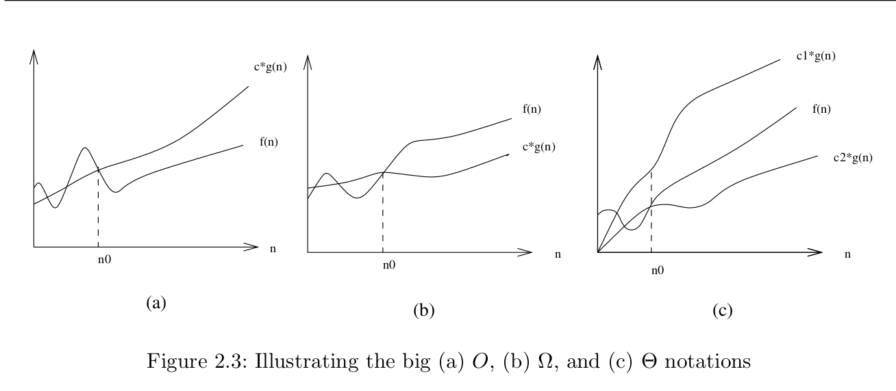

# Asymptotic Analysis

Algorithm analysis is a way to compare the time and space efficiency of programs
with respect to their possible inputs, but irrespective of other context.

[Example](./sum_of_nums.go)

# Big O Notation

An algorithm is a series of steps required to perform a task. If we treat each
step as a basic unit of computation, then an algorithm's execution time can be
expressed as the number of steps required to solve the problem.

In the example above, `sumOfNums` requires more steps to complete than
`arithmeticSum`. Given that steps are repeated in `sumOfNums`, the program takes
longer to complete if we increase the value of n.

The most expensive unit of computation in `sumOfNums` is variable assignment.
The initial assignment `total := 0` is performed once, followed by a loop that
executes `(total += i)n` times.

This can be denoted as T(n) = 1 + n.

n is often used to refer to the "size of the problem". The above can be read as
"T(n) is the time it takes to solve a problem of size n, namely 1 + n steps."

In order to be more precise, we're not going to worry about the exact number of
operations an algorithm performs and determine the dominant part of the T(n)
function. As the problem gets larger, some portion of the T(n) function tends to
overpower the rest - this is what we care about.

The _order of magnitude_ function (or Big O) describes the part of T(n) that increases
fastest as the value of n increases. We write it as O(f(n)) where f(n) is the
dominant part of the original T(n).

In the above example, we saw that T(n) = 1 + n. As n gets larger, the constant 1
will become less significant to the result. If we are looking for an
approximation of T(n), then we can drop the 1 and say that the running time is
O(n).

Suppose we have an algorithm whose exact number of steps can be expressed as
T(n) = 5n^2 + 27n + 1005. When n is small, the constant 1005 seems to be the
dominant part of the function. As n gets larger 5n^2 dwarfs the other terms in
the final result.

For an approximation of T(n) at large values of n, we can focus on 5n^2 and
ignore the other terms. As n gets even larger, the coefficient 5 becomes
insignificant. We can then say T(n) has an order of magnitude f(n) = n^2, or
more simply O(n^2).

The common order of magnitude functions are listed below in order from lowest to
highest:

```
f(n)        |   	Name
----------------------------
1                constant
log n            logarithmic
n                linear
n log n          log linear
n^2              quadratic
n^3              cubic
2^n              exponential
```

~[Big O Graph](https://bradfieldcs.com/algos/analysis/big-o-notation/figures/big-o-plot.png)

Go example:

```go

func bigFunc(n int) {
  a := 5
  b := 6                          // 3 assignments                   => 3
  c := 10

  for i,_ := range n {
    for j, _ := range n {
      x := i * i
      y := j * j                 // 3 assignments in nested iteration => 3n^2
      z := i * j
    }
  }

  for k,_ := range n {
    w := a * k + 45              // 2 assignments iterated n times    => 2n
    v := b * b
  }
  d := 33                        // 1 assignment                      => 1
}
```

Putting these all together: T(n) = 3 + 3n^2 + 2n + 1 = 3n^2 + 2n + 4. By looking
at the exponents, we can see that the n^2 term will be dominant, so this
function is O(n^2).

# ADM
## Demonstrating Incorrectness

The best way to prove that an algorithm is incorrect is to produce an instance in which yields incorrect answers. Good counter-examples have two important properties:
1. Verifiability - You must be able to (1) calculate what answer your algorithm will give in this instance, and (2) display a better answer so as to prove the algorithm didn't find it.
2. Simplicity - good counter-examples have all unnecessary details boiled away. They make clear exactly why the proposed algorithm fails.

Here are techniques to help identify counter examples:
1. Think small
  - Great algorists look carefully at several small examples, because they are easier to verify and reason about
2. Think exhaustively
  - There are only a small number of possibilities for the smallest nontrivial value of n. 
3. Hunt for the weakness
  - If an algorithm is of the form "always take the biggest" think about why that might prove to be the wrong thing to do
4. Go for a tie
  - A good way to break a heuristic is to provide instances where everything is the same size.
5. Seek extremes
  - Many counter-examples are mixtures of huge ang tiny. It is usually easier to verify or reason about extreme examples than more muddled ones.

## Summations

Recognizing two basic classes of summation formulae will get you a long way in algorithm analysis.

- Arithmetic progressions

TODO complete reading

## Big-O Notation

The formal definitions associated with Big-O notation are:

- f(n) = O(g(n)) means c * g(n) is an upper bound on f(n). Thus there exists some constant c such that f(n) is always <= c * g(n), for large enough n (i.e., n >= n₀).

- f(n) = Ω(g(n)) means c * g(n) is a lower bound on f(n). Thus there exists some constant c such that f(n) is always >= c * g(n), for all n >= n₀.

- f(n) = θ(g(n)) means c₁ * g(n) is an upper bound on f(n) and c₂ * g(n) is a lower bound on f(n), for all n >= n₀. thus there exist constants c₁ and c₂ such that f(n) <= c₁ * g(n) and f(n) >= c₂ * g(n). This means that g(n) provides a nice, tight bound on f(n).



# Examples

- O(1)
```c
void printFirstElementOfArray(int arr[])
{
    printf("First element of array = %d",arr[0]);
}

```

- O(n)
```c
void printAllElementOfArray(int arr[], int size)
{
    for (int i = 0; i < size; i++)
    {
        printf("%d\n", arr[i]);
    }
}
```

- O(n²) Example
```c
void printAllPossibleOrderedPairs(int arr[], int size)
{
    for (int i = 0; i < size; i++)
    {
        for (int j = 0; j < size; j++)
        {
            printf("%d = %d\n", arr[i], arr[j]);
        }
     }
}
```

- O(2ⁿ) Example
```c
int fibonacci(int num)
{
    if (num <= 1) return num;
    return fibonacci(num - 2) + fibonacci(num - 1);
}
```

- O(n!) example:
```c
void nFacRuntimeFunc(int n) {
  for(int i=0; i<n; i++) {
    nFacRuntimeFunc(n-1);
  }
}
```

- O(log n) example:
```c
int nlogn(int x) {
  while (x > 0) {  
    x /= 2;  
  }  
  return x;
}
```

- O(n log n)

```cpp
void mergeSort(vector<int>& vectorToSort)
{
    // BASE CASE: arrays with fewer than 2 elements are sorted
    if (vectorToSort.size() < 2) {
        return;
    }

    // STEP 1: divide the array in half
    // we use integer division, so we'll never get a "half index"
    size_t midIndex = vectorToSort.size() / 2;

    vector<int> left(vectorToSort.begin(), vectorToSort.begin() + midIndex);
    vector<int> right(vectorToSort.begin() + midIndex, vectorToSort.end());

    // STEP 2: sort each half
    mergeSort(left);
    mergeSort(right);

    // STEP 3: merge the sorted halves
    size_t currentLeftIndex  = 0;
    size_t currentRightIndex = 0;

    for (size_t currentSortedIndex = 0; currentSortedIndex < vectorToSort.size();
            ++currentSortedIndex) {

        // sortedLeft's first element comes next
        // if it's less than sortedRight's first
        // element or if sortedRight is exhausted
        if (currentLeftIndex < left.size()
                && (currentRightIndex >= right.size()
                || left[currentLeftIndex] < right[currentRightIndex])) {
            vectorToSort[currentSortedIndex] = left[currentLeftIndex];
            ++currentLeftIndex;
        }
        else {
            vectorToSort[currentSortedIndex] = right[currentRightIndex];
            ++currentRightIndex;
        }
    }
}
```

# Class

