# Hashing

# Priority Queues, Sets and Maps

## Hashing

A hash table is a collection of items which are stored in such a way as to make
it easy to find them later.

- Each position (called a slot) can hold an item and is named by an integer
  value starting at 0.
- We can implement a hash table by using a list with each element initialized to
  `nil`.

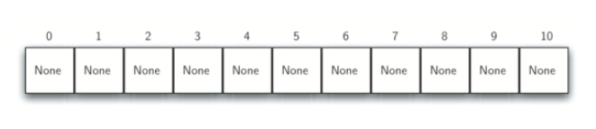 an example of what this looks like

The mapping between an item and the slot where that item belongs is called the
hash function.

- The hash function takes an item in the collection and returns an integer in
  between 0 and m-1 where m is the length of the list.
- A common strategy is called the "remainder method" which takes an item and
  divides it by the table size, returning the remainder as its hash value
  `(h(item) = item % 11)`
- Once the hash values have been computed, we can insert them into the hash
  table at the designated position shown in the figure below.

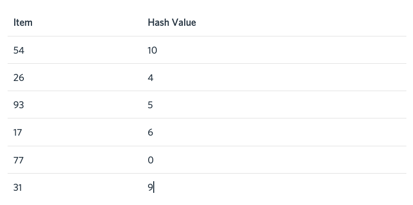 gives the hash values for the example items.

- In this example, 6 of the 11 slots are occupied. This is called the load
  factor and is denoted by `lambda = number_of_items/table_size`. Here `lambda = 6/11`.
- When we want to search for an item, we use the hash function to compute the
  slot name for the item and then check the hash table to see if it is present.
- This operation is O(1) since a constant amount of time is required to compute
  the hash value and index the hash table at that location.
- This technique works only if each item maps to a unique location. If the item
  44 had been the next item in our collection, it would have a hash value of 0
  (44 % 11 == 0). Since 77 also had a hash value of 0, we would have a
  collision.

### Hash Functions

A hash function that maps each item into a unique slot is referred to as a
perfect hash function. The only way to construct a perfect hash function is if
the items in the collection will never change.

- One way to always have a perfect hash function is to increase the size of the
  hash table so that each possible value in the item range can be accommodated.
  This guarantees that each item will have a unique spot. This is not feasible
  when the number of possible items is large.
- Our goal is to create a hash function that minimizes the number of collisions,
  is easy to compute and evenly distributes the items in the hash table.

The _folding method_ for constructing hash functions begins by dividing the item
into equal-size pieces (the last piece may not be of equal size). These pieces
are then added together to give the resulting hash value.

- For example, if our item was the phone number 436-555-4601, we would take the
  digits and divide them into groups of 2 (43,65,55,46,01).

  - After the addition, 43 + 65 + 55 + 46 + 01, we get 210. If we assume our
    hash table has 11 slots, then we need to perform the extra step of dividing
    by 11 and keeping the remainder. In this case 210 % 11 = 1, so the phone
    number 436-555-4601 hashes to slot 1.
  - Some folding methods go one step further and reverse every other piece
    before the addition. For example, we get 43 + 56 + 55 + 64 + 01 = 219 which
    gives 219 % 11 = 10.

Another numerical technique for constructing a hash function is called the
mid-square method.

- First, we square the item, and then extract some portion of the resulting
  digits. For example, if the item were 44, we would first compute 44² = 1,936.
- By extracting the middle two digits, 93, and performing the remainder step, we
  get 93 % 11 = 5. The table below shows items under both the remainder method
  and mid-square method.

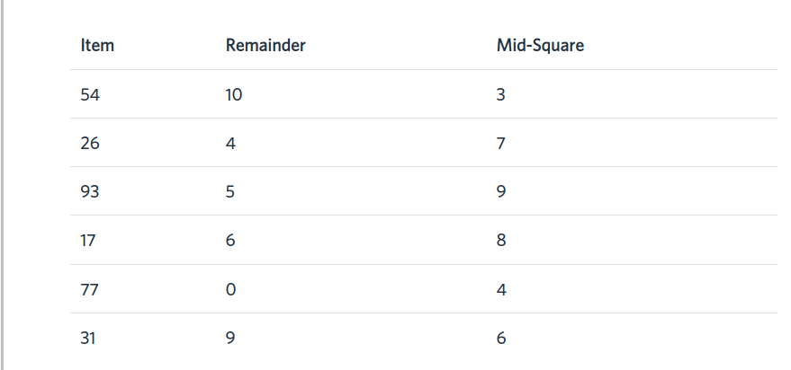

We can also create hash functions for strings. The word "cat" is made up of
characters so we can think of it as being a sequence of ascii values:

```
int('c') -> 99
int('a') -> 97
int('t') -> 116
```

We can take these three values, add them up, and use the remainder method to get
a hash value:

```
hashValue = (99 + 97 + 116) % 11
hashValue = (312) % 11
hashValue = 4
```

This is a function called hash that takes a string and a table size and returns
the hash value in the range from 0 to tablesize - 1.

```
func hash(astring string, tablesize int) int {
  theSum := 0
  for _, ch := range astring {
    theSum += int(ch)
  }
  return theSum % tablesize
}
```

With this method, anagrams will always be given the same hash value. To remedy
this, we could use the position of the character as a weight:

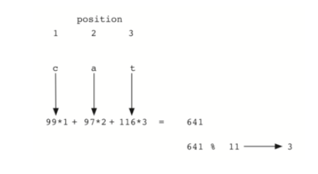

### Collision Resolution

When two items hash to the same slot, we must have a systematic method for
placing the second item in the hash table. This process is called a collision
resolution.

One method for resolving collisions looks into the hash table and tries to find
another open slot to hold the item that caused the collision. To do this, start
at the original hash value position and then move in a sequential manner through
the slots until we encounter the first slot that is empty. Note that we may need
to go back to the first slot (circularly) to cover the entire hash table. This
method is referred to as open addressing because it tries to find the next open
address in the hash table. By visiting each slot at a time, we are performing an
open addressing technique called linear probing.

The illustration below shows an extended set of integer items under the simple
remainder method hash function (54,26,93,17,77,31,44,55,20). When we attempt to
place 44 into slot 0, a collision occurs. Under linear probing, we look
sequentially, slot by slot, until we find an open position. In this case, we
find slot 1.

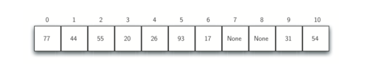

Again, 55 should go into slot 0 but must be placed in slot 2 since it is the
next open position. The final value of 20 hashes to slot 9. Since slot 9 is
full, we begin to do linear probing - visiting slots 10, 0, 1, 2, and then
finally find an empty slot at position 3.

Once we have built a hash table using open addressing and linear probing, it is
essential that we utilize the same methods to search for items. Assume we want
to look up the item 93. When we compute the hash value, we get 5. Looking in
slot 5 reveals 93, and we can return True. What if we are looking for 20? Now
the hash value is 9, and slot 9 is currently holding 31. We cannot simply return
False since we know that there could have been collisions. We are now forced to
do a sequential search, starting at position 10, looking until either we find
the item 20 or we find an empty slot.

Disadvantages to linear probing:

- Clustering: items become clustered in the table. This means that if many
  collisions occur at the same hash value, a number of surrounding slots will be
  filled by the linear probing resolution. This will have an impact on other
  items that are being inserted. [Here](./clustering.png) is an example.
  - One solution to this is to extend the linear probing technique so that
    instead of looking sequentially for the next open slot, we skip slots,
    thereby more evenly distributing the items that have caused collisions. This
    will potentially reduce the clustering that occurs. For example, if you used
    a "plus 3" probe, we will look at every third slot until we find one that is
    empty.

The general name for this process of looking for another slot after a collision
is rehashing. With simple linear probing, the rehash function is:

```
newhashvalue = rehash(oldhashvalue)
where
rehash(pos) = (pos + 1) % sizeoftable
```

The "plus3" rehash can be defined as:

```
rehash(pos) = (pos + 3) % sizeoftable
```

In general, `rehash(pos) = (pos + skip) % sizeoftable`. It is important to note
that the size of the "skip" must be such that all the slots in the table will
eventually be visited. Otherwise, part of the table will be unused. To ensure
this, it is often suggested that the table size be a prime number. This is why
all of the examples have used 11.

A variation of linear probing is quadratic probing. Instead of using a constant
"skip" value, we use a rehash function that increments the hash by 1,3,5,7,9,
and so on. This means that if the first hash value is h, the successive values
are h+1, h+4, h+9, h+16, etc. Quadratic probing uses a skip consisting of
successive perfect squares. Here is an example:

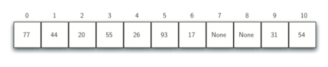

An alternative method for handling the collision problem is to allow each slot
to hold a reference to a collection (or chain) of items. Chaining allows many
items to exist at the same location in the hash table. When collisions happen,
the item is still placed in the proper slot of the hash table. As more and more
items hash to the same location, the difficulty of searching for the item in the
collection increases. Here is an example:

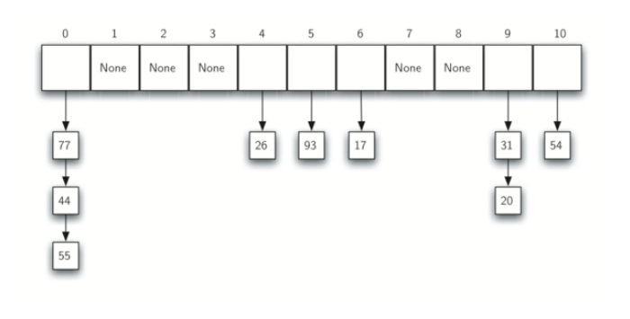

### Analysis

In the best case hashing provides a O(1), constant time search technique. Due to
collisions, the number of comparisons is typically not so simple. Let `lambda`
stand for the load factor. If lambda is large, meaning that the table is filling
up, then there are more and more collisions. This means that collision
resolution is more difficult, requiring more comparisons to find an empty slot.
With chaining, increased collisions means an increased number of items on
each chain.

We will have a result for both a successful and an unsuccessful search.

- For a successful search using open addressing with linear probing, the average
  number of comparisons is approximately 1/2(1 + (1 / (1 - lambda)))
- An unsuccessful search gives 1/2(1 + (1 - lambda)^2)
- If we are using chaining, the average number of comparisons is 1 + (lambda/2)
  For the successful case, and simply lambda comparisons if the search is
  unsuccessful.

## Priority Queues with Binary Heaps

A priority queue acts like a queue in that items remain in it for some time
before being dequeued. However, in a priority queue the logical order of items
inside is determined by their "priority". Specifically, the highest priority
items are retrieved from the queue ahead of lower priority items. Examples of
this might include message queues or task queues which typically prioritize some
items over others.

The classic way to implement a priority queue is using a data structure called a
binary heap. A binary heap will allow us to enqueue or dequeue items in O(log
n).

The binary heap is interesting because when we diagram the heap it looks a lot
like a tree, but when we implement it we use only a single dynamic array as its
internal representation.

The binary heap has two common variations: the min heap and the max heap.

- Min Heap: The smallest key is always at the front
- Max Heap: The largest key value is always at the front

The interface for our binary heap will be:

```
type BinaryHeap interface {
  // BinaryHeap creates a new, empty, binary heap
  BinaryHeap()

  // Insert add a new item to the heap
  Insert(interface{})

  // FindMin returns the item with the minimum key value, leaving item in the
  heap
  FindMin() interface{}

  // DelMin returns the item with the minimum key value, removing the item
  from the heap.
  DelMin() interface{}

  // IsEmpty returns true if the heap is empty, false otherwise
  IsEmpty() bool

  // Returns the number of items in the heap
  Size() int

  // BuildHeap builds a new heap from a list of keys
  BuildHeap([]interface{})
}
```

The implementation can be found [here](./binary_heap.go)

### The Structure Property

In order for our heap to work efficiently, we will take advantage of the
logarithmic nature of the binary tree to represent our heap. In order to
guarantee logarithmic performance, we must keep our tree balanced.

- A balanced binary tree has roughly the same number of nodes in the left and
  right subtrees of the root.
- Complete Binary Tree: a tree in which each level has all of its nodes.
- We will keep the tree balanced, with the exception of the bottom level of the
  tree, which will be filled in from left to right.
- Example:

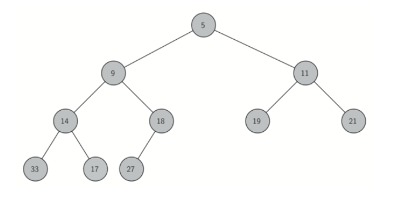

Another interesting property of a complete tree is that we can represent it
using a single list.

- Because the tree is comlete, the left child of a parent (p) is the node that
  is found in position 2p in the list. The right child of the parent is at
  position 2p + 1 in the list.
- To find the parent of any node in the tree, we can use integer division
  (discarding remainder). Given that a node is at position n in the list, the
  parent is at position n/2.

Note the 2p and 2p+1 relationship between parent and children. The list
representation of the tree, along with the full structure property allows us to
efficiently traverse a complete binary tree using only a few mathematical
operations.

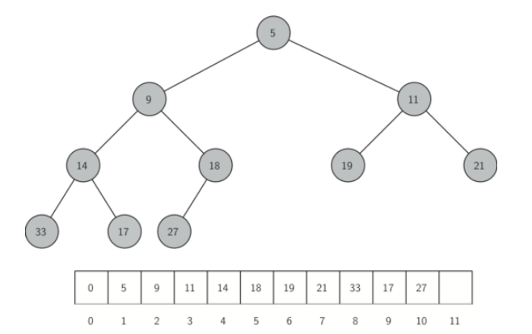

### The Heap Order Property

Heap order property: in a heap, for every node x with parent p, the key in p is
smaller than or equal to the key in x. The diagram above illustrates a complete
binary tree that has the heap order property.

The easiest and most efficient way to add an item to a list is to simply append
to the end of the list.

- This will maintain the complete tree property
- However, it will very likely violate the heap structure property. It's
  possible to write a method that will allow us to regain the heap structure
  property by comparing the newly added item with its parent by comparing the
  newly added item with its parent. If the newly added item is less than its
  parent, then we can swap the item with its parent. Here is the diagram:

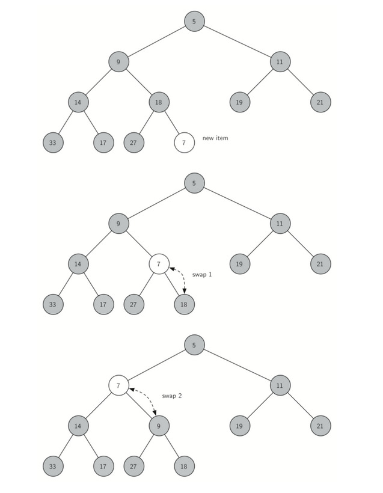

Since the heap properly requires that the root of the tree be the smallest item
in the tree, finding the minimum item is easy.

- The hard part of `DeleteMin` is restoring full compliance with the heap
  structure and heap order properties after the root has been removed. This can
  be restored in two steps:
  1. Restore the root item by taking the last item in the list and moving it to
     the root position. This maintains our heap structure property. This does
     destroy the heap order property of the heap.
  2. Restore heap order property by pushing the new root node down the tree to
     its proper position.

Here is the diagram:

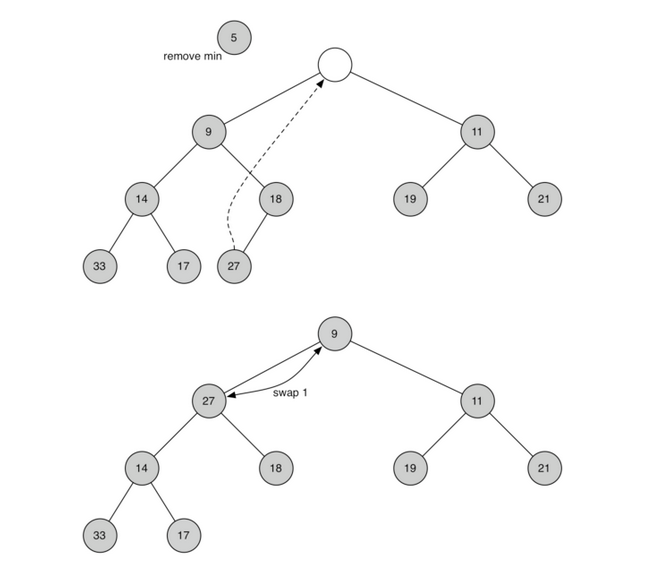
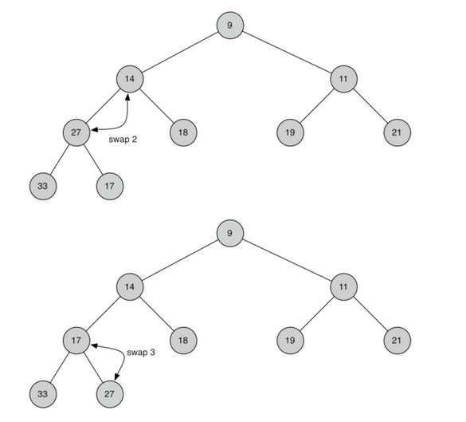

### Building Heap


### Analysis of Hashing


#### Successful

average number of comparisons


load = 5/10 = 1/2
1/2(1 + 1 / load)
1/2(1 + 1 / 0.5)
1/2(1 + 2)
1/2(3)
1.5


Chance of bucket being empty? 1 - lambda

E = expected number of attempts you will need

E = (1 - lambda) * 1 + lambda(1    +    E)
         ^         ^          ^         ^
chance of empty    1 try      wasted      reset, try again
                               try 

E = 1 - lambda + lambda + lambda * E

E(1 - lambda) = 1

E = 1 / 1 - lambda

#### Unuccessful

load = 5/10 = 1/2
