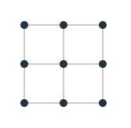
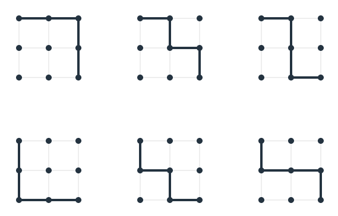
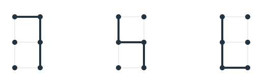
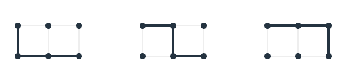

# Recursion / Dynamic Programming

Dynamic programming is a powerful technique for solving a certain class of
problems, typically in a more efficient manner than the corresponding recursive
strategy. Specifically, when a problem consists of “overlapping subproblems,” a
recursive strategy may lead to redundant computation. The corresponding dynamic
programming strategy may avoid such waste by addressing and solving the
subproblems one at a time in a manner without overlap.

Consider this implementation of fibonacci:

```go
func fib(n int) int {
	if n <= 1 {
		return n
	}
	return fib(n - 1) + fib(n - 2)
}
```

The running time of this implementation is `O(2^n)` due to a very large number
of redundant recursive executions. When we call `fib(n)` we recursively call
`fib(n - 1)` and `fib(n - 2)` which themselves call `fib(n - 2)` and `fib(n - 3)`
and `fib(n - 3)`and`fib(n - 4)`, respectively.

This is a good time to consider that the “top down” approach of recursive
problem solving has a counterpart, the unsurprising “bottom up” approach of
dynamic programming.

Applying dynamic programming to this problem, we ask ourselves “starting with 0
and 1, how do we build up an answer to `f(n)`?” If n were 0 or 1, we could
answer immediately. If it were 2, however, we would need to add 0 and 1 to
determine the answer: 1. If n were 3, we would need to add the answer to `f(2)`,
that we just determined, to the 1 that we previously determined, giving a total
of 2. Following this strategy, we obtain 3, 5, 8, etc., until we have reached
the answer for our n.

An implementation of this might look like:

```go
func fib(n int) int {
	a := 0
	b := 1
	for i := 0; i < n: i++ {
		tmp := a
		a = a + b
		b = temp
	}
	return a
}
```

With this implementation, we sacrifice some of the elegance and readability of
our recursive solution, but gain a much better `O(n)` running time and `O(1)`
space cost.

Let's consider a problem with a little more meat: Given a lattice of height `H`
and width `W`, how many unique shortest paths exist from the top left corner to
bottom right corner?

Consider this lattice: 

We can see that the shortest path from top left to bottom right will be of
length 4, and there are 6 unique paths of length 4: 

Exploring this, we realize that any shortest path must always progress down and
to the right. Anything else wouldn't make sense. By grouping those paths that
start with a right step and those that start with a down step, we can break this
traversal problem into subproblems.

The total number of paths along a `H * W` lattuce is the sum of the number of
paths along a
`(H - 1) * W` lattice and a `H * (W - 1)` lattice.

The paths starting with a right step lead to the 1x2 subproblem with these three
solutions:


We can see that this is a repetition of the our first three solutions to the 2x2
problem (fig 1).

Similarly, the paths starting downward on our 2x2 problem (second 3 solutions in
fig 1) lead to the 2x1 subproblem with the following three solutions:


We can then say that the total number of paths along a HxW lattice is the sum of
those along a `(H - 1) x W` lattice and a `H x (W - 1)` lattice. By taking the
top down approach to explore the recursive nature of the problem, we've
identified a recursive relationship: `f(h, w) = f(h, w - 1) + f(w, h - 1)`

In order to fill out the recursive solution, we must recognize the base case:
when the `h` or `w` of our subproblem is 0, we are dealing with a straight line,
so the number of paths is simply 1.

Here is the recursive solution:

```go
func numPaths(height int, width int) int {
	if height == 0 || width == 0 {
		return 1
	}
	return numPaths(height, width - 1) + numPaths(height - 1, width)
}
```

Unfortunately, this is another `O(2^n)` solution where n = H + W).

After some exploring, you'll recognize that in order to calculate the number of
unique paths to any point on the lattice, we must solve the subproblems of the
number of paths to each of the points to the left and above the point in
question.

Those problems can be solved if we first answer the subproblems of the number of
paths to each of the points to the left and above those points.

If we start with the top leftmost point (which we can say can be reached in only
1 way) we can then iterate through every point on the lattice, row by row, and
calculate the paths to that point as the sum of the paths to the points above
and to the left. The nature of this iteration is such that we have already
calculated each of those points precisely one time.

We can use a 2D array to store our computed values as we proceed. For a HxW lattice, we can use a (H+1) x (W+1) list of lists, with each entry representing the number of paths that one may take to arrive at that vertex.

We may initialize the values to 1, as we know that there is only one way to arrive at a vertex on the top or left edtes. Then iterating through each entry of each row, we can determine the number of paths to that vertx by adding the number of paths to the vertexes directly above and to the left.

Finally, we access the value computed in the last entry of the lsat row of our memo, which represents the number of paths to traverse the entire lattice.

This is the memo that we will generate in the process of computing `f(2, 2)` using this strategy:

```
[
  [1, 1, 1],
  [1, 2, 3],
  [1, 3, 6]
]
```

Again, we arrive at our answer 6.

This is what the memo looks like for `f(10, 10)`:

```
[
    [1, 1, 1, 1, 1, 1, 1, 1, 1, 1, 1],
    [1, 2, 3, 4, 5, 6, 7, 8, 9, 10, 11],
    [1, 3, 6, 10, 15, 21, 28, 36, 45, 55, 66],
    [1, 4, 10, 20, 35, 56, 84, 120, 165, 220, 286],
    [1, 5, 15, 35, 70, 126, 210, 330, 495, 715, 1001],
    [1, 6, 21, 56, 126, 252, 462, 792, 1287, 2002, 3003],
    [1, 7, 28, 84, 210, 462, 924, 1716, 3003, 5005, 8008],
    [1, 8, 36, 120, 330, 792, 1716, 3432, 6435, 11440, 19448],
    [1, 9, 45, 165, 495, 1287, 3003, 6435, 12870, 24310, 43758],
    [1, 10, 55, 220, 715, 2002, 5005, 11440, 24310, 48620, 92378],
    [1, 11, 66, 286, 1001, 3003, 8008, 19448, 43758, 92378, 184756]
]
```

Here is a possible implementation for the strategy discussed:

```go
func numPathsDP(height int, width int) int {
	memo := make([][]int, height)
	for i := 0; i < height; i++ {
		memo[i] = make([]int, width)
		for j := 0; j < width; j++ {
			memo[i][j] = 1
		}
	}

	for i := 1; i < len(memo); i++ {
		row := memo[i]
		for j := 1; j < len(row); j++ {
			memo[i][j] = memo[i - 1][j] + memo[i][j - 1]
		}
	}
	return memo[height-1][width-1]
}
```
