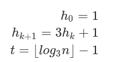

# Divide & Conquer

Consier this function whose only purpos is to swap two data values at the given
positions:

```go
func Exchange(data []int, m, n int) []int {
	temporary := data[m]
	data[m] = data[n]
	data[n] = temporary
	return data
}
```

Before calling `Exchange`:

```
data: [ -1, 8, 11, 22, 9, -5, 2 ]
index: 0 1 2 3 4 5 6
```

After `Exchange(data, 2, 5)` the array would look like:

```
data: [ -1, 8, -5, 22, 9, 11, 2 ]
index: 0 1 2 3 4 5 6
```

Swapping two values in an array is no different than swapping any two integers:

```go
a := 5
b := 35
t := a
a = b
b = t
```

After this is done, the value of `a` would be 25 and the value of `b` would be 25.

The `Exchange` function is important for sorting algorithms because it is used
whenever two items are found to be out of order. Generally, this swap isn't
permenant, it just means that temporarily, the items have been reordered so
we'll get closer to having a sorted array.

## Bubble Sort

Bubble Sort works by repeatedly scanning through the array exchanging adjacent
elements that are out of order.

- Each sweep picks up the largest remaining element and moves to the right as
  far as it can go.
- That means it is not necessary to scan through the entire array each time.
- Instead, each sweep only goes to the beginning of the sorted portion.

We define the _inversions_ as the number of element pairs that are out of order.
They do not need to be _adjacent_.

- If `data[7] > data[16]`, that's an inversion.
- Every time an inversion is required, we would also say that there is
  corresponding data movement. For example, the `Exchange` function requires 3
  movements ot take place, which happens very quickly on most processors but
  still
  amounts to a significant cost.
- There can be at most `N * (N-1)/2` inversions in the array of length `N`. The
  maximum number of inversions occurs when the array is sorted in reverse order
  and has no equal elements.
- Only adjacent elements are exchanged. Each exchange removes one inversion.
  Therefore, Bubble Sort requires `O(N^2)` exchanges.

Example:

```go
func Exchange(data []int, m, n int) []int {
	temporary := data[m]
	data[m] = data[n]
	data[n] = temporary
	return data
}

func BubbleSort(data []int) []int {
	N := len(data)
	for j := N-1; j > 0; j-- {
		for i := 0; i < j; i++ {
			if data[i] > data[i+1] {
				data = Exchange(data, i, i+1)
			}
		}
	}
	return data
}
```

## Selection Sort

Selection Sort works to minimize the amount of data movement, hence the number
of `Exchange` calls:

```go
func MinValPos(data []int, start int) int {
	N := len(data)
	minPos := start
	for pos := start+1; pos < N; pos++ {
		if data[pos] < data[minPos] {
			minPos = pos
		}
	}
	return minPos
}

func SelectionSort(data []int) []int {
	N := len(data)
	for i := 0; i < N-1; i++ {
		k := MinValPos(data, i)
		if i != k {
			data = Exchange(data, i, k)
		}
	}
	return data
}
```

Selection Sort works like this:

1. An outer loop visits each item in the array to find out whether it is the
   minimum of all the elements after it.
2. If it is not the minimum, the value is swapped with whatever item in the rest
   of the array is the minimum

For example:

```
data: [ 12, 8, -5, 22, 9, 2 ]
index: 0 1 2 3 4 5
				 i k
```

The first time through the loop, `i` is 0, and `k` gets the value 2, since
data[2] is -5, the smallest element. Those two positions get swapped:

```
data: [ -5, 8, 12, 22, 9, 2 ]
index: 0 1 2 3 4 5
```

The next time through the loop `i` is 1 and `k` becomes 5:

```
data: [ -5, 8, 12, 22, 9, 2 ]
index: 0 1 2 3 4 5
						i k
```

After the swap:

```
data: [ -5, 2, 12, 22, 9, 8 ]
index: 0 1 2 3 4 5
```

This continues until the rest of the array is sorted.

Most of the work of Selection Sort is done through comparisons. The same number
of comparisons are executed no matter how the data is ordered. This is exactly
`N * (N-1)/2` which is `O(N^2)` with the number of exchanges being `O(N)`.

## Insertion Sort

Insertion Sort builds up a longer and longer sorted list from the bottom of the
array. We repeatedly insert th next element into the sorted part of the array by
sliding it down to its proper position using that `Exchange` function:

```go
func InsertionSort(data []int) []int {
	N := len(data)
	for j := 1; j<N; j++ {
	  // the comparison in the loop condition is key to how this algorithm works
		for i := j; i>0 && data[i] < data[i-1]; i-- {
			data = Exchange(data, i, i-1)
		}
	}
	return data
}
```

`-` - Element that is known to be in the sorted list at the beginning of the array
`j` - The next element we are trying to insert at the right position

Example:

```
data: [ 12, 8, -5, 22, 9, 2 ]
index:   0  1   2  3   4  5
			   -  j
```

After each outer loop in sequence we end up with:

```
data: [ 8, 12, -5, 22, 9, 2 ]
index:  0   1   2  3   4  5
			   -  -   j

data: [ -5, 8, 12, 22, 9, 2 ]
index:   0  1   2  3   4  5
			   -  -   -  j

data: [ -5, 8, 12, 22, 9, 2 ]
index:   0  1   2  3   4  5
			   -  -   -  -   j

data: [ -5, 8, 9, 12, 22, 2 ]
index:   0  1   2  3   4  5
			   -  -   -  -   -  j

data: [ -5, 2, 8, 9, 12, 22 ]
index:   0  1   2  3   4  5
			   -  -   -  -   -  -
```

This will require as many exchanges as Bubble Sort, since only one inversion is
removed per exchange. So Insertion Sort also requires O(N^2) exchanges. On
average Insertion Sort requires only half as many comparisons as Bubble Sort,
since the average distance an element must move for random input is one-half the
length of the sorted portion.

## Shell Sort

Shell Sort is basically a trick to make Insertion Sort run faster. Since
Insertion Sort removes one inversion per exchange, it cannot run faster than the
number of inversions in the data, which in worst case is `O(N^2)`. We can't do
anything about the lower bound of `O(N)` because each element must be visited.
But we can do something about the number of steps to remove inversions.

The trick in Shell Sort is to start off swapping elements that are further apart.

- Shell Sort considers the subsequences of elements spaced `k` elements apart
- There are `k` such sequences starting at positions `0` through `k-1` in the array.
- Elements `k` positions apart are exchanged, removing between 1 and `2(k-1)+1` inversions.
- Several passes are executed with decreasing values of k, ending with `k=1`.

In this example, we sort all subsequences of elements 8 apart, then 4, 2, and 1:

```
func ShellSort(data []int, invervals []int) {
  N := len(data)

  for k := len(intervals)-1; k >=0; k-- {
    interval := intervals[k]
    for m := 0; m< interval; m++ {
      for j := m+interval; j<N; j+=interval {
        for i := j; i >= interval && data[i]<data[i-interval]; i -= interval {
          data = Exchange(data, i, i-interval)
        }
      }
    }
  }
  return data
}

func ShellSortNaive(data []int) {
  intervals := []int{ 1, 2, 4, 8 }
  data = ShellSort(data, intervals)
}
```

Shell Sort with sequences of jump sizes that are powers of one another don't
tend to do as well as sequences where most jump sizes are not multiples of others
because it more effectively mixes up the data. The number of intervals must be
increased as the size of the array to be sorted increases. That explains why we
allow an arbitrary arra of intervals to be specified.

Donald Knuth suggested a couple of methods for computing the intervals:



The bracket like notation is the notation for the floor function - the largest
integer <= x.

This results in a sequence 1, 4, 13, 40, 121... you stop computing values in the
sequence when `t = log_3(n)-1`. So for n=50,000 you should have about 9-10
intervals.

`log_3(n)` must be sufficiently large (and > 2) for this method to work. Our
code ensures this by taking the maximum of `log_3(n)` and 1.

Knuth also suggests:


This results in a sequence 1, 3, 7, 15, 31...

Here is the improvement to our naive method that dynamically calculates the
intervals based on the first suggestion of Knuth:

```go
import "math"

func ShellSortBetter(data []int) []int {
  intervals := GenerateIntervals(len(data))
  data = ShellSort(data, intervals)
  return data
}

func GenerateIntervals(n int) []int {
  if n < 2 {
    return []int{0}
  }

  intervals := []int{}
  t := int(math.Max(1.0, Log(float64(n), 3)-1))
  for i := 1; i < t; i++ {
    intervals[i] = 3 * intervals[i-1]+1
  }
  return intervals
}

func Log(base, x float64) float64 {
  return math.Log(x) / math.Log(base)
}

func ShellSort(data []int, invervals []int) {
  N := len(data)

  for k := len(intervals)-1; k >=0; k-- {
    interval := intervals[k]
    for m := 0; m< interval; m++ {
      for j := m+interval; j<N; j+=interval {
        for i := j; i >= interval && data[i]<data[i-interval]; i -= interval {
          data = Exchange(data, i, i-interval)
        }
      }
    }
  }
  return data
}

```

Shell Sort is a complex sorting algorithm to make work well, which is why it is
not seen in practice very often. That said, Shell Sort minimizes memory
requirements which is why it can be seen most often in embedded systems work.

## Quicksort / Partition Sort

Quicksort is one of the best sorts for random data, having an average time
behavior of `O(N log N)`. While it has an excellent average behavior, it has a
worst case performance of `O(N^2)`.

```go
func Quicksort(data []int) []int {
  if len(data) < 1 {
    return data
  }

  lowI := 0
  highI := len(data)-1
  afterSmall := lowI
  beforeBig := highI
  pivot := data[(lowI + highI)/2]

  /*
    In loop data[i] <= pivot if i < afterSmall
            data[i] >= pivot if i > beforeBig
            region with aftersmall <= i <= beforeBig shrinks to nothing
  */

  for afterSmall <= beforeBig {

    for data[afterSmall] < pivot {
      afterSmall++
    }

    for pivot < data[beforeBig] {
      beforeBig--
    }

    if afterSmall <= beforeBig {
      data = Exchange(data, afterSmall, beforeBig)
      afterSmall++
      beforeBig--
    }
  }

  /*
    After loop: beforeBig < afterSmall, and
      data[i] <= pivot for i <= beforeBig,
      data[i] == pivot for i if beforeBig < i < afterSmall,
      data[i] >= pivot for i >= afterSmall
  */

  // at least two elements
  if lowI < beforeBig {
    return Quicksort(data, lowI, beforeBig)
  }

  // at least two elements
  if afterSmall < highI {
    return Quicksort(data, afterSmall, highI
  }

  return data
}
```

Sorting the array is accomplished by dealing with sections. It picks an
arbitrary element as `pivot` and then swaps elements with values above and below
the pivot until the part of the arra being processed is in three sections:

1. elements <= pivot
2. possibly an element equal to pivot
3. elements >= pivot

Though sections 1 and 3 aren't sorted, there are no inversions _between_ any two
separate sections. Only the smaller sections 1 and 3 need to be sorted
separately, and only then if they have at least two elements. They can be sorted
by calling the same function, but with a smaller range of indices to deal with
in each case The recursive calls stop when a part is reduced to one element.

The outer `while` loop has fairly complicated logic. To prove it is correct
overall, you can state and prove the simpler loop invariant expressed in the
comments above the loop. This allows the conclusion after the loop, discussed in
the comment after the loop.

## Random Data Generation

To check the performance of these sorts in a real-world situation, we're going
to start by modeling the situation when the data is in random order:

```go
import "math/rand"

func Generate(data []int, randomSeed int) {
  rd := rand.New(rand.NewSource(randomSeed))
  for i := 0; i < len(data); i++ {
    data[i] = rd.Int()
  }
  return data
}
```

- In order to regenerate a particular example, we need the random sequence to be
  consistent, so we know that each of the sorting algorithms being tested is using
  the same random data.
