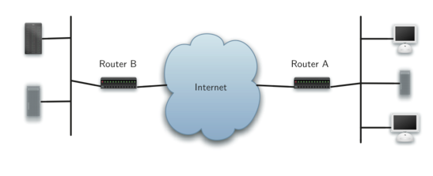
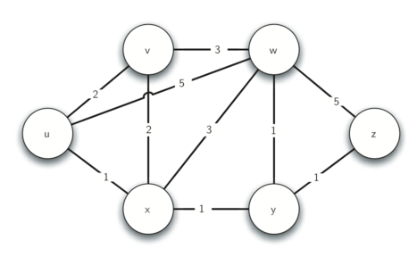

# Weighted Graphs

## Dijkstra's Shortest Path Algorithm

The diagram above shows a high-level overview of how communication on the
internet works. Every request made from your web browser, tavels through your
local area network and out onto the internet through a series of routers. When
the requested resource is returned from the server, the response travels back
through the same routers to get back to your browser.

The job of all of these routers is to work together to get your information from
place to place. You can try this out with `traceroute google.com`. Each router
on the internet is connected to one or more other routers. We can represent the
network of routers as a graph with weighted edges:

This small example represents the interconnection of routers on the internet.
The problem that we want to solve is to find the path with the smallest total
weight along which to route any given message. This is similar to BFS, except
that here we are concerned with the total weight of the path rather than the
number of hops in the path.

### Dijkstra's Algorithm

Dyjkstra's algorithm is an iterative algorithm that provides us with the
shortest path from one particular starting node to all other nodes in the graph.

To keep track of the total cost from the start node to each destination, we will
make use of a `distances` map which we will initialize to 0 for the start
vertex, and infinity for the other vertices. Our algorithm will update these
values until they represent the smallest weight path from the start to the
vertex in question, at which point we will return the `distances` map.

The algorithm iterates once for every vertex in the graph; however the order
that we iterate over the vertices is controlled by a priority queue. The value
that is used to determine the order of the objects in the priority queue is the
distance from our starting vertex. By using a priority queue, we ensure that as
we expore one vertex after another, we are always exploring the one with the
smallest distance.

[Here](./dijkstra/main.cc) is the implementation of this.

It's important to note that Dijkstra's algorithm only works when the weights are
all positive. If a nfgative weight is presen, then the algorithm will never
exit.

In practice, Dijkstra's algorithm is not used directly for finding the shortest
path because then the entire graph would need to be known up front. Instead
algorithms based on Dijkstra's like the "distance vector" routing algorithm are
used.

#### Analysis of Dijkstra's Algorithm

Building the `distances` map takes O(V) time since we add every vertex in the
graph to the dictionary.

The `while` loop is executed once for every entry that gets added to the
priority queue. An entry can only be added when we explore an edge, so there are
at most O(E) iterations of the `while` loop.

The `for` loop is executed at most once for every vertex, since the
`current_distance > distances[current_vertex]` check ensures that we only
process a vertex once. The `for` loop iterates over outgoing edges, so among all
iterations of the `while` loop, the body of the `for` loop executes at most O(E)
times.

Finally, if we consider that each priority queue operation (adding/removing an
entry) is an O(log E), we conclude that the total running time is O(V + E log
E).

### A\* Search

A* Search is a modification of Dijkstra's Algorithm that is optimized for a
single destination. Dijkstra's Algorithm can find paths to al locations; A*
finds paths to one location, or the closest of several locations. It prioritizes
paths that seem to be leading closer to a goal.

Continue reading
[this](https://www.redblobgames.com/pathfinding/a-star/introduction.html)

## Practice

- [Network Delay Time](https://leetcode.com/problems/network-delay-time/description/)
  - [Walkthrough video](https://www.youtube.com/watch?v=pjITHX3JwH0)
- [Sliding Puzzle](https://leetcode.com/problems/sliding-puzzle/)

## Prep

- Translate the python scaffolding to C++ or Go.
- Read through
  [this](https://my.bradfieldcs.com/algorithms/2020-06/advanced-graph-search/exercise/)
  explanation.
- Review [my
  implementation](https://github.com/danieljamespost/IO2DRoutePlanner) of A\*
  Search
