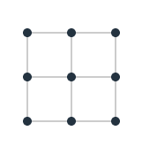

# Dynamic Programming

## Questions to consider

- In what scenarios can it be beneficial to apply dynamic programming?
- What are the differences between the memoization (top-down) and tabulation
  (bottom-up) approaches?
- Is there a relationship between the parameters of a recursive function and the
  corresponding memo table? What about between the time and space complexities
  of a top-down approach?

## What is Dynamic Programming

Dynamic Programming is a powerful technique for solving problems that would
typically be solved resursively but doing so in a more efficient way. When a
problem consists of "overlapping subproblems," a recursive strategy may lead to
redundant computation. The corresponding dynamic programming strategy may avoid
this waste by addressing and solving the subproblems one at a time without
overlap.

## An Example

Here is an implementation of the nth fibonnaci number using recursion:

```go
func fib(n int) int {
  if n <= 1 {
    return n
  }
  return fib(n-1) + fib(n-2)
}
```

The running time of the above solution is O(2^n) due to a very large number of
redundant recursive executions.

If we think about this problem, we'll quickly realize that at any point in time
we only need to retain a memory of the previous two calculations, and we never
obtain the same sum twice. Here's a solution using dynamic programming:

```go
func fib(n int) int {
  a := 0
  b := 1

  for i := 0; i < n; i++ {
    temp := a
    a = a + b
    b = temp
  }
  return a
}
```

With this implementation, we sacrifice some of the elegance and readability of
our recursive solution, but gain a much better O(n) running time and O(1) space
cost.

## A more complicated example

Given a lattice of height H and width W, how many unique shortest paths exist
from the top left corner to bottom right corner?



We can see that the shortest path from top left to bottom right will be of
length 4, and that there are 6 unique paths of length 4:


Any shortest path must always progress down and to the right. Any path that
progresses up or left at any point has no chance of being "shortest". By
grouping those paths that start with a right step (top line in image above) and
those that start with a down step (bottom line in image above), we can break
this traversal problem into subproblems.

The total number of paths along a HxW lattice is the sum of those along a
(H-1)xW lattice and a Hx(W-1) lattice.

Using the 2x2 example, the paths starting with a right step lead to the 1x2
subproblem with these three solutions:


Similarly, the paths starting downward on our 2x2 problem lead to the 2x1
subproblem with the following three solutions:


We can now say with some confidence that the total number of paths along a HxW
lattice is the sum of those along a (H-1)xW lattice and a Hx(W-1) lattice. By
taking a top down approach to explore the recursive nature of the problem, we've
identified a recursive relationship: `f(h, w) = f(h, w-1) + f(w, h-1)`.

Before writing the recursive solution, we should recognize our base case: when
the h or w of our subproblem is 0, we are dealing with a straight line, so the
number of paths is simply 1:

```go
func numPaths(h int, w int) int {
  if h == 0 || w == 0 {
    return 1
  }
  return numPaths(h, w-1) + numPaths(h-1, w)
}
```

This is another O(2^n) solution. This shuld be a signal that using a bottom up
approach will be faster due to being able to compute and store the answer to
subproblems before addressing the core problem.

In order to calculate the number of unique paths to any point on the lattice, we
must solve the subproblems of the number of paths to each of the points to the
left and above the point in question. Those subproblems can be solved if we
first answer the subproblems of the number of paths to each of the points to the
left and above ethose points. If we start with the top leftmost point we can
then iterate through every point of the lattice, row by row, and calculate the
paths to that point as the sum of the paths to the points above and to the left,
which by the nature of our iteration we have already calculated precisely one
time.

We can use a 2D array to store our computed values as we proceed. For a HxW
lattice, we can use a (H+1)x(W+1) list of lists with each entry representing the
number of paths to arrive at that vertex. We'll initialize the values to 1 as we
know that there is only one way to arrive at a vertex on the top or left edges.
Iterating through each entry of each row, we cn determine the number of paths to
that vertex by adding the number of paths to the vertexes directly above and to
the left. Finally, we retrieve the value of the last entry in the last row of
our memo, which represents the number of paths to traverse the entire lattice.

This is the memo that we will generate in the process of computing `f(2,2)`:

```
[
    [1, 1, 1],
    [1, 2, 3],
    [1, 3, 6]
]
```

Here is a possible implementation of the dynamic programming strategy discussed:

```cpp

int numPathsDP(int h, int w)
{
  vector<vector<int>> memo(h+1, vector<int>(w+1, 1));

  for (int i=1; i<memo.size(); i++)
  {
    vector<int> row = memo[i];
    for (int j=1; j<row.size(); j++) {
      memo[i][j] = memo[i-1][j] + memo[i][j-1];
    }
  }
  return memo[h][w];
}

```

Both the time and space cost for this implementation are O(HxW), compared to the
O(2^(H+W)) time and O(H+W) space previously, making a big time difference as H
and W increase.

## FAST Method

The FAST method is a repeatable process that you can follow every time to find an optimal solution to any dynamic programming problem.

It is comprised of 4 steps:
1. Find the recursive solution
2. Analyze the solution
3. Identify the subproblems
4. Turn around the solution